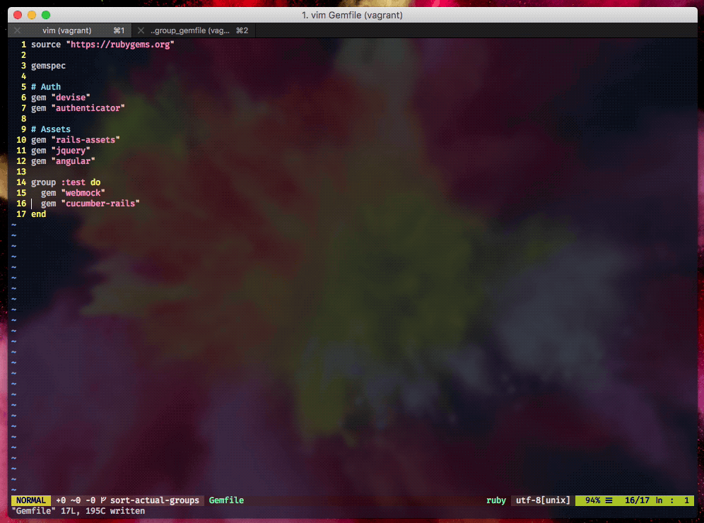

# ordinare

[](https://semaphoreci.com/nikolalsvk/ordinare)
[](https://badge.fury.io/rb/ordinare)
[](CONTRIBUTING.md#5-make-a-pull-request)

Ordinare sorts gems in your Gemfile alphabetically



In order to install the gem, do:

```
$ gem install ordinare
```

## Usage :pick:

Position yourself inside Rails project with Gemfile and do:

```
$ ordinare
```

And that's it!
Ordinare will sort your Gemfile and overwrite your current Gemfile.

If you don't want ordinare to overwrite your Gemfile, see [Don't overwrite Gemfile](#dont-overwrite-gemfile).

_NOTE: be sure to do `$ bundle install` after ordinare sorts your Gemfile just
to make sure everything is OK._

### Love for the gem groups :heart:

If you're using something along these lines in your Gemfile:
```ruby
...

group :test do
  gem "webmock"
  gem "cucumber-rails"
end

group :development do
  gem "byebug"
  gem "spring"
do

...
```
ordinare will consider groups inside your Gemfile and will sort
gems inside those groups, not messing them up.

### Love for the comment groups :green_heart:

If you're organizing your gems using comments in similar fashion:
```ruby
...

# Auth
gem "devise"
gem "oauth2"

# Assets
gem "sprockets"
gem "sprockets-es6"
gem "pusher"

...
```
ordinare will sort gems below your comments, treating them as groups
(e.g. "Auth" group and "Assets" group).

## Advanced usage :hammer_and_pick:

### Pass in path to Gemfile

You can pass in path to your gemfile:

```
$ ordinare --path my_awesome_project/Gemfile
```

And that's it!
You can find your ordered Gemfile at `my_awesome_project/Gemfile`.

### Don't overwrite Gemfile

Ordinare has an option that will make Gemfile.ordinare instead of overwriting
your original Gemfile.

Just call ordinare like this:

```
$ ordinare --no-overwrite
```

And that's it!
You can find your ordered Gemfile at `Gemfile.ordinare`.

## Contributing :writing_hand:

Any suggestions and improvements are more than welcome :bowing_man:.

If you'd like to contribute, you can check [CONTRIBUTING.md](CONTRIBUTING.md)
